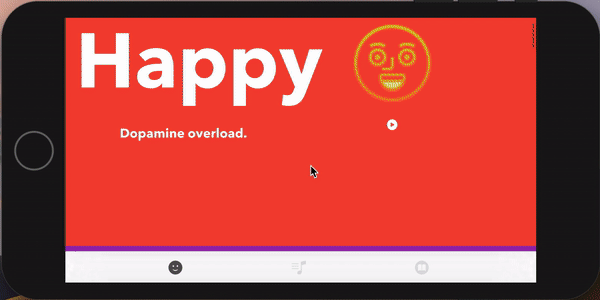

%202%20(1).png)
# VYBZ

A music creation and education tool to inspire musicians from beginner to advanced to create the music of your desired mood along with teaching you the building blocks of music.   

## Features 
* Piano that recommends scales and chord progressions to fit your desired song mood
* Song examples to inspire your mood
* Educates users how to use music theory to create betters 
* Easy and Simple to use User Experience 
* Piano plays chord progressions at the click of a button 
.gif) 

## The Mood Music Algorithim 
There are 12 possible notes available to us in music. There's an infinite amount of ways to arrange these notes into what is called a 'scale'. Which is when a series of notes is played. Every one of these scales evokes a different type of emotion in the listeners ear. 

#### How it works
1. Choose your mood. Every mood is related to a particular scale based off the 'Greek Modes' and other scales such as the Blues and Spanish Gypsy.  
.png)
2.  Then the algorithim asks you to choose your desired key.   
.png)
3. The app then takes this information and creates a scale and chord progression that matches the mood for you to write your song too! 

.png)

## Technologies Used  
* AV Foundation  
* UIKit
* Firebase Backend 
* Swift 
* Cocoa Pods(GLNPianoView/MusicTheorySwift/AnimatedCollectionView)
